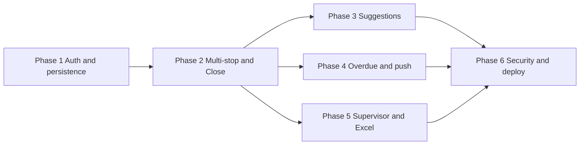

# SPRC TX Log — Implementation Plan

## Current state vs spec

You already have a working shell that the plan builds on:

| Area               | Now                                                                                                   | Per spec                                                                     |
| ------------------ | ----------------------------------------------------------------------------------------------------- | ---------------------------------------------------------------------------- |
| **Auth**           | [PinLogin.jsx](src/components/PinLogin.jsx): 4-digit UI only; mock user                               | Firestore `users` lookup by PIN, role/site, 5-fail lockout, 60 min auto-lock |
| **Data**           | [App.jsx](src/App.jsx): transports in React state                                                     | Firestore `transports` (and later `clients`, `destinations`)                 |
| **Transport flow** | [TransportCard.jsx](src/components/TransportCard.jsx): single destination, single ARRIVE, no DC check | Multi-stop, multiple ARRIVE, DC check per ARRIVE, dedicated Close Checklist  |
| **Reasons**        | Chips; "Medical Appointment"                                                                          | "Medical X appointment" (and same list); multi-select kept                   |
| **List**           | [TransportList.jsx](src/components/TransportList.jsx): in-memory, tech-only                           | Firestore-backed; tech = own only; supervisor = all + filters + export       |

Firestore is initialized in [src/firebase.js](src/firebase.js) but not yet used for users or transports.

---

## Data model (reference)

- **users**: `id`, `name`, `pin`, `role` (`tech`  `supervisor`), `site` (`PHP`  `RTC`), `active`
- **clients**: `id`, `label`, `normalizedLabel`, `createdAt`
- **destinations**: `id`, `name`, `address`, `normalizedAddress`, `createdAt`
- **transports**: `id`, `site`, `createdByUserId`, `createdByName`, `status` (`open`  `returned`  `closed`), `departedAt`, `returnedAt`, `clients[]`, `reasons[]`, `stops[]` (each with `destinationName`, `destinationAddress`, `arrivedAt`, `dcCheck`, optional `note`), `closeChecklist`, `createdAt`, `updatedAt`, `closedAt`

---

## Phase 1 — Authentication + roles + persistence

**Goal:** Real PIN login and transports in Firestore; tech sees only own, supervisor sees all.

1. **Firestore `users` and PIN login** ✅ COMPLETED
  - ✅ Created seed script [scripts/seedUsers.js](scripts/seedUsers.js) - clears and repopulates users collection with 3 test users (2 techs, 1 supervisor)
  - ✅ Updated [PinLogin.jsx](src/components/PinLogin.jsx): queries Firestore for user by PIN + active status, implements 5-failure lockout (5 minutes), tracks attempts in localStorage, returns full user object `{ id, name, role, site }`
  - ✅ Updated [App.jsx](src/App.jsx): now receives and stores full user object with `id`, `role`, `site`
  - **To setup:** Run `npm run seed` to reset users collection, then `npm run dev` to test with PINs: 1234, 5678, or 9999
2. **Create and list transports in Firestore** ✅ COMPLETED
  - ✅ Updated [App.jsx](src/App.jsx): creates Firestore transport on "New Transport" with full data structure
  - ✅ Tech home: real-time query of own transports only (`createdByUserId === user.id`)
  - ✅ Supervisor: real-time query of all transports (no user filter)
  - ✅ Updated [TransportList.jsx](src/components/TransportList.jsx): displays Firestore data with proper formatting
3. **Navigation and "current transport"** ✅ COMPLETED
  - ✅ App manages `currentTransportId` state for editing
  - ✅ Updated [TransportCard.jsx](src/components/TransportCard.jsx): loads/saves from/to Firestore

**Done when:** Two techs can log in with different PINs and each sees only their own transports; supervisor sees all. ✅ READY TO TEST

---

## Phase 2 — Real workflow (multi-stop, DC check, Close Checklist)

**Goal:** One transport = multiple stops; ARRIVE adds a stop and triggers DC check; RETURN → Close Checklist; required fields enforced before Close.

1. **Transport document shape**
  - Align with spec: `stops[]` per transport; each stop has `destinationName`, `destinationAddress`, `arrivedAt`, `dcCheck: { completed, option, note }`, optional `note`. No single `destination` field.
2. **Transport Card (quick start)**
  - **Entry:** New Transport still opens card with prominent **DEPART**. On DEPART, set `departedAt` and `status: 'open'` (already in Phase 1).
  - **Header order:** Clients, Reasons, Destinations (stops) at top.
  - **Clients:** Keep free text; store as array of strings (e.g. one chip per client). Required before Close (enforced on Close Checklist).
  - **Reasons:** Keep multi-select chips; use spec list: "Medical X appointment", "Outside Provider", "Job interview", "Court", "Pharmacy", "Lab Work", "Dental", "Other".
  - **Stops/destinations:** Replace single destination with "Add another" chips. Each stop must have at least **address** (and preferably name). For Phase 2, manual name + address per stop is enough; suggestions come in Phase 3.
  - **ARRIVE:** Tapping ARRIVE adds a **new** stop to `stops` with `arrivedAt: now`, and immediately open **DC Paperwork Check** modal/screen. Do not allow "skip"; save `dcCheck` on that stop (option required; if option is "Other", note required). After DC check, return to Transport Card; ARRIVE can be pressed again for another stop.
  - **RETURN:** Set `returnedAt`, `status: 'returned'`, then **navigate to dedicated Close Checklist screen** (not inline close).
3. **Close Checklist screen (new)**
  - New component/screen shown after RETURN. Checks: at least one client, at least one stop with address. If missing, show what's missing and block Close. On Close: set `status: 'closed'`, `closedAt`, then redirect to home.
4. **Persistence**
  - All transport updates (stops, clients, reasons, status, closeChecklist) write to the same Firestore `transports` document so list and card stay in sync.

**Done when:** One transport can have multiple ARRIVEs (multiple stops with addresses), each ARRIVE forces DC check (Other → note required), RETURN sends user to Close Checklist, and Close is blocked until requirements are met.

---

## Phase 3 — Suggestions and dedupe

**Goal:** Clients and destinations become autosuggest; dedupe destinations by address.

1. **Clients**
  - On adding a client (e.g. when blurring input or adding chip), upsert into `clients` (e.g. by `normalizedLabel` or merge). When typing in client field, query `clients` for suggestions (prefix match on `normalizedLabel`), show as dropdown or chips. No formatting enforcement.
2. **Destinations**
  - When user enters name + address for a stop, save to `destinations` (with `normalizedAddress` for dedupe). When adding a stop, suggest from `destinations` (e.g. match on name or address). If new address matches existing `normalizedAddress`, suggest "Use existing: …" and link to that destination.
3. **UI**
  - "Add another" chips for both clients and stops; suggestions appear from Firestore as user types (client search) or when adding a destination (pick or create new).

**Done when:** Previously used clients and destinations appear as suggestions; re-entering same address suggests using existing destination.

---

## Phase 4 — Overdue and notifications

**Goal:** Overdue state visible in UI; hourly push to tech + supervisor until resolved.

1. **Overdue definition**
  - Define rule (e.g. no `returnedAt` within X hours of `departedAt`, or past a wall-clock cutoff). Store computed `overdue: boolean` or derive in UI/Cloud Function.
2. **UI**
  - In Transport List and supervisor view, show overdue badge/state; filters in Phase 5 can include "overdue".
3. **Push notifications**
  - Firebase Cloud Messaging (FCM): request permission, store FCM token per user (e.g. in `users` or a `tokens` subcollection). Backend: scheduled function (e.g. Cloud Scheduler + Cloud Function) runs every hour, finds overdue transports, resolves tech + supervisor and sends push (one per user, deduplicated by transport). Logs retained per spec.

**Done when:** Overdue transports are clearly indicated and tech + supervisor receive hourly push until return/close.

---

## Phase 5 — Supervisor dashboard and Excel export

**Goal:** Default current-month view, filters, fuzzy client search, Excel export (one row per transport).

1. **Supervisor dashboard**
  - Default date range: current month. Filters: date range, driver (createdByUserId/name), overdue (yes/no). Sort by date (then driver/overdue as needed). Fuzzy client search: query transports where `clients` array contains a string matching search (e.g. lowercase partial match); consider `normalizedLabel` in `clients` if you index by client later.
2. **Export**
  - Button "Export Excel": build a table with one row per transport (flatten stops into columns or a single cell per transport, per spec). Use a client-side library (e.g. xlsx / SheetJS) to generate file and trigger download. No server-side requirement if all data is loaded.

**Done when:** Supervisor can filter by date/driver/overdue, search client fuzzily, and download current view as Excel (one row per transport).

---

## Phase 6 — Security and production

**Goal:** Firestore rules enforce permissions; lockout and auto-lock; deploy to Netlify.

1. **Firestore rules**
  - Tech: read/write only documents where `createdByUserId == request.auth.uid` (or your equivalent if using custom auth). Supervisor: read/write all transports. `users`: users can read own profile by PIN or by doc id after auth. `clients`/`destinations`: read/write as needed (e.g. all authenticated users can write for suggestions).
  - Note: With PIN-only auth you may use Firebase Anonymous or a custom token after PIN verification; then `request.auth.uid` can map to your user id.
2. **Session**
  - Track last activity; after 60 minutes inactivity, clear session and redirect to PIN screen (or lock screen).
3. **Lockout**
  - After 5 failed PIN attempts, disable login for a set duration (e.g. 5 minutes — **confirm this value**). Show "Locked until HH:MM" and re-enable when time has passed.
4. **Editing rules**
  - Tech: cannot edit another tech's transport; cannot edit closed transports (read-only). Supervisor: can edit any transport including closed. Enforce in UI and in Firestore rules (e.g. allow update only if `resource.data.status != 'closed'` for tech, or allow for supervisor).
5. **Netlify**
  - Build: `npm run build`; publish `dist`. Connect repo; env vars for Firebase if needed (keys in front-end are OK for Firestore client; restrict by domain in Firebase Console).

**Done when:** Rules prevent tech from reading/writing others' data and editing closed transports; supervisor can do both; 60 min auto-lock and 5-fail lockout work; app runs on Netlify.

---

## Open decision

- **Lockout duration** after 5 wrong PIN attempts: ✅ DECIDED - Implemented as 5 minutes in Phase 1.

---

## Suggested file/component map

- **Auth:** [PinLogin.jsx](src/components/PinLogin.jsx) — Firestore user lookup, lockout state, pass user (id, name, role, site) to App.
- **App:** [App.jsx](src/App.jsx) — Routing (home / transport / closeChecklist / supervisor), current user, currentTransportId, load transport from Firestore.
- **Tech home:** [TransportList.jsx](src/components/TransportList.jsx) — Firestore query for `createdByUserId === user.id`, overdue badges, "New Transport" and "Continue" for open.
- **Transport card:** [TransportCard.jsx](src/components/TransportCard.jsx) — DEPART (create/update in Firestore), clients (chips + Phase 3 suggestions), reasons (chips), stops (chips + "Add another", address required), ARRIVE → add stop + open DC check, RETURN → navigate to Close Checklist.
- **DC check:** New component (e.g. `DCCheckModal.jsx` or `DCCheckScreen.jsx`) — options including Other; note required if Other; save to current stop's `dcCheck`.
- **Close checklist:** New component (e.g. `CloseChecklist.jsx`) — validate clients + at least one stop with address; show missing; Close button sets status to closed and redirects.
- **Supervisor:** New screen/route (e.g. `SupervisorDashboard.jsx`) — date range (default current month), driver filter, overdue filter, fuzzy client search, table/list, Export Excel button.
- **Firebase:** [firebase.js](src/firebase.js) — add FCM in Phase 4 if needed; keep Firestore and app init here. Optional: small auth helper (e.g. set custom token after PIN verify) for rules.

---

## Order and dependencies

Phase 1 is the foundation. Phase 2 restores the full workflow on top of Firestore. Phase 3 and 4 can follow Phase 2; Phase 5 (supervisor/export) can run in parallel with 3/4. Phase 6 (security and deploy) should use the final auth and permission model (lockout duration decided).

This plan keeps your "quick start" and "required before Close" rules, matches the data model and UI flow you specified, and fits your existing Vite + React + Firestore setup.
