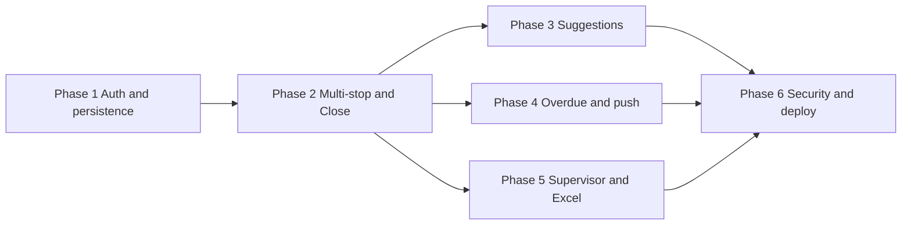

# SPRC TX Log — Implementation Plan

## Current state vs spec

You already have a working shell that the plan builds on:

| Area               | Now                                                                                                   | Per spec                                                                     |
| ------------------ | ----------------------------------------------------------------------------------------------------- | ---------------------------------------------------------------------------- |
| **Auth**           | [PinLogin.jsx](src/components/PinLogin.jsx): 4-digit UI only; mock user                               | Firestore `users` lookup by PIN, role/site, 5-fail lockout, 60 min auto-lock |
| **Data**           | [App.jsx](src/App.jsx): transports in React state                                                     | Firestore `transports` (and later `clients`, `destinations`)                 |
| **Transport flow** | [TransportCard.jsx](src/components/TransportCard.jsx): single destination, single ARRIVE, no DC check | Multi-stop, multiple ARRIVE, DC check per ARRIVE, dedicated Close Checklist  |
| **Reasons**        | Chips; "Medical Appointment"                                                                          | "Medical X appointment" (and same list); multi-select kept                   |
| **List**           | [TransportList.jsx](src/components/TransportList.jsx): in-memory, tech-only                           | Firestore-backed; tech = own only; supervisor = all + filters + export       |

Firestore is initialized in [src/firebase.js](src/firebase.js) but not yet used for users or transports.

---

## Data model (reference)

- **users**: `id`, `name`, `pin`, `role` (`tech`  `supervisor`), `site` (`PHP`  `RTC`), `active`
- **clients**: `id`, `label`, `normalizedLabel`, `createdAt`
- **destinations**: `id`, `name`, `address`, `normalizedAddress`, `createdAt`
- **transports**: `id`, `site`, `createdByUserId`, `createdByName`, `status` (`open`  `returned`  `closed`), `departedAt`, `returnedAt`, `clients[]`, `reasons[]`, `stops[]` (each with `destinationName`, `destinationAddress`, `arrivedAt`, `dcCheck`, optional `note`), `closeChecklist`, `createdAt`, `updatedAt`, `closedAt`

---

## Phase 1 — Authentication + roles + persistence

**Goal:** Real PIN login and transports in Firestore; tech sees only own, supervisor sees all.

1. **Firestore `users` and PIN login** ✅ COMPLETED
  - ✅ Created seed script [scripts/seedUsers.js](scripts/seedUsers.js) - clears and repopulates users collection with 3 test users (2 techs, 1 supervisor)
  - ✅ Updated [PinLogin.jsx](src/components/PinLogin.jsx): queries Firestore for user by PIN + active status, implements 5-failure lockout (5 minutes), tracks attempts in localStorage, returns full user object `{ id, name, role, site }`
  - ✅ Updated [App.jsx](src/App.jsx): now receives and stores full user object with `id`, `role`, `site`
  - **To setup:** Run `npm run seed` to reset users collection, then `npm run dev` to test with PINs: 1234, 5678, or 9999
2. **Create and list transports in Firestore** ✅ COMPLETED
  - ✅ Updated [App.jsx](src/App.jsx): creates Firestore transport on "New Transport" with full data structure
  - ✅ Tech home: real-time query of own transports only (`createdByUserId === user.id`)
  - ✅ Supervisor: real-time query of all transports (no user filter)
  - ✅ Updated [TransportList.jsx](src/components/TransportList.jsx): displays Firestore data with proper formatting
3. **Navigation and "current transport"** ✅ COMPLETED
  - ✅ App manages `currentTransportId` state for editing
  - ✅ Updated [TransportCard.jsx](src/components/TransportCard.jsx): loads/saves from/to Firestore

**Done when:** Two techs can log in with different PINs and each sees only their own transports; supervisor sees all. ✅ READY TO TEST

---

## Phase 2 — Real workflow (multi-stop, DC check, Close Checklist) ✅ COMPLETED

**Goal:** One transport = multiple stops; ARRIVE adds a stop and triggers DC check; RETURN → Close Checklist; required fields enforced before Close.

1. **Transport document shape** ✅ COMPLETED
  - ✅ `stops[]` array structure: each stop has `destinationName`, `destinationAddress`, `arrivedAt`, `dcCheck: { completed, option, note }`
2. **Transport Card (quick start)** ✅ COMPLETED
  - ✅ Updated [TransportCard.jsx](src/components/TransportCard.jsx): Clients as chips (add/remove), multi-select reasons with spec list ("Medical X appointment", etc.), multi-stop support
  - ✅ Stops: Name (optional) + Address (required) input fields, displays all previous stops
  - ✅ ARRIVE: Requires address, adds stop, immediately opens DC Check modal (cannot skip)
  - ✅ RETURN: Sets `returnedAt`, navigates to Close Checklist screen
3. **Close Checklist screen (new)** ✅ COMPLETED
  - ✅ Created [CloseChecklist.jsx](src/components/CloseChecklist.jsx): validates at least one client + at least one stop with address
  - ✅ Shows validation errors, blocks Close button if requirements not met
  - ✅ On Close: sets `status: 'closed'`, `closedAt`, redirects to home
4. **DC Check Modal** ✅ COMPLETED
  - ✅ Created [DCCheckModal.jsx](src/components/DCCheckModal.jsx): options (All signed, Missing signature, Incomplete, Other), requires note if "Other" selected
5. **Persistence** ✅ COMPLETED
  - ✅ Real-time Firestore updates for all transport changes (clients, reasons, stops, notes, status)
  - ✅ Updated [App.jsx](src/App.jsx): routing between transport, closeChecklist, and home

**Done when:** One transport can have multiple ARRIVEs (multiple stops with addresses), each ARRIVE forces DC check (Other → note required), RETURN sends user to Close Checklist, and Close is blocked until requirements are met. ✅ READY TO TEST

---

## Phase 3 — Suggestions and dedupe ✅ COMPLETED

**Goal:** Clients and destinations become autosuggest; dedupe destinations by address.

1. **Clients** ✅ COMPLETED
  - ✅ Updated [TransportCard.jsx](src/components/TransportCard.jsx): saves clients to `clients` collection on add, searches with normalized text matching, shows dropdown suggestions
2. **Destinations** ✅ COMPLETED
  - ✅ Saves destinations to `destinations` collection with `normalizedAddress` for dedupe, shows suggestions when typing name or address
3. **UI** ✅ COMPLETED
  - ✅ Autocomplete dropdowns for both clients and destinations with fuzzy matching

**Done when:** Previously used clients and destinations appear as suggestions; re-entering same address suggests using existing destination. ✅ READY TO TEST

---

## Phase 4 — Overdue and notifications ✅ PARTIALLY COMPLETED

**Goal:** Overdue state visible in UI; hourly push to tech + supervisor until resolved.

1. **Overdue definition** ✅ COMPLETED
  - ✅ Updated [TransportList.jsx](src/components/TransportList.jsx): defines overdue as >8 hours since departure without return
2. **UI** ✅ COMPLETED
  - ✅ Shows red border and "OVERDUE" badge on transport cards, included in supervisor dashboard filters
3. **Push notifications** ⏸️ SKIPPED (requires Cloud Functions / paid Firebase plan)
  - Not implemented - would require Firebase Cloud Messaging + Cloud Functions for scheduled hourly notifications

**Done when:** Overdue transports are clearly indicated ✅ UI indicators complete. Push notifications skipped (requires paid plan).

---

## Phase 5 — Supervisor dashboard and Excel export ✅ COMPLETED

**Goal:** Default current-month view, filters, fuzzy client search, Excel export (one row per transport).

1. **Supervisor dashboard** ✅ COMPLETED
  - ✅ Created [SupervisorDashboard.jsx](src/components/SupervisorDashboard.jsx): defaults to current month, filters by date range, driver dropdown, overdue status (all/yes/no), fuzzy client search
  - ✅ Updated [App.jsx](src/App.jsx): shows dashboard for supervisor role users
2. **Export** ✅ COMPLETED
  - ✅ "Export to Excel" button with xlsx library, one row per transport, includes all fields (date, driver, clients, stops, status, overdue, notes)

**Done when:** Supervisor can filter by date/driver/overdue, search client fuzzily, and download current view as Excel (one row per transport). ✅ READY TO TEST

---

## Phase 6 — Security and production ✅ COMPLETED

**Goal:** Firestore rules enforce permissions; lockout and auto-lock; deploy to Netlify.

1. **Firestore rules** ✅ COMPLETED
  - ✅ Created [firestore.rules](firestore.rules): tech can only update own non-closed transports; supervisor can update/delete any; clients/destinations open for all
2. **Session** ✅ COMPLETED
  - ✅ Updated [App.jsx](src/App.jsx): 60-minute auto-lock with activity tracking (mousedown, keydown, scroll, touchstart), alerts user and redirects to PIN screen
3. **Lockout** ✅ COMPLETED (Phase 1)
  - ✅ 5-failure lockout with 5-minute duration in [PinLogin.jsx](src/components/PinLogin.jsx)
4. **Editing rules** ✅ COMPLETED
  - ✅ Enforced in Firestore rules and UI routing (tech sees own transports only, supervisor sees all via dashboard)
5. **Netlify** ✅ COMPLETED
  - ✅ Created [netlify.toml](netlify.toml): build command, publish dir, SPA redirect
  - ✅ Build verified: `npm run build` produces `dist/`

**Done when:** Rules prevent tech from reading/writing others' data and editing closed transports; supervisor can do both; 60 min auto-lock and 5-fail lockout work; app runs on Netlify. ✅ ALL PHASES COMPLETE

---

## Open decision

- **Lockout duration** after 5 wrong PIN attempts: ✅ DECIDED - Implemented as 5 minutes in Phase 1.

---

## Suggested file/component map

- **Auth:** [PinLogin.jsx](src/components/PinLogin.jsx) — Firestore user lookup, lockout state, pass user (id, name, role, site) to App.
- **App:** [App.jsx](src/App.jsx) — Routing (home / transport / closeChecklist / supervisor), current user, currentTransportId, load transport from Firestore.
- **Tech home:** [TransportList.jsx](src/components/TransportList.jsx) — Firestore query for `createdByUserId === user.id`, overdue badges, "New Transport" and "Continue" for open.
- **Transport card:** [TransportCard.jsx](src/components/TransportCard.jsx) — DEPART (create/update in Firestore), clients (chips + Phase 3 suggestions), reasons (chips), stops (chips + "Add another", address required), ARRIVE → add stop + open DC check, RETURN → navigate to Close Checklist.
- **DC check:** New component (e.g. `DCCheckModal.jsx` or `DCCheckScreen.jsx`) — options including Other; note required if Other; save to current stop's `dcCheck`.
- **Close checklist:** New component (e.g. `CloseChecklist.jsx`) — validate clients + at least one stop with address; show missing; Close button sets status to closed and redirects.
- **Supervisor:** New screen/route (e.g. `SupervisorDashboard.jsx`) — date range (default current month), driver filter, overdue filter, fuzzy client search, table/list, Export Excel button.
- **Firebase:** [firebase.js](src/firebase.js) — add FCM in Phase 4 if needed; keep Firestore and app init here. Optional: small auth helper (e.g. set custom token after PIN verify) for rules.

---

## Order and dependencies

Phase 1 is the foundation. Phase 2 restores the full workflow on top of Firestore. Phase 3 and 4 can follow Phase 2; Phase 5 (supervisor/export) can run in parallel with 3/4. Phase 6 (security and deploy) should use the final auth and permission model (lockout duration decided).

This plan keeps your "quick start" and "required before Close" rules, matches the data model and UI flow you specified, and fits your existing Vite + React + Firestore setup.
